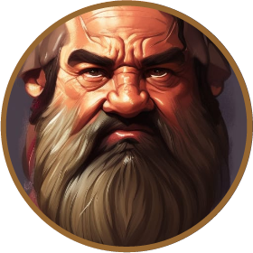
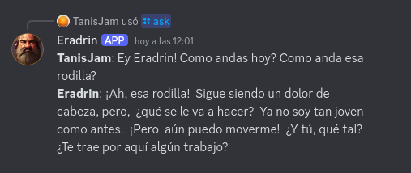
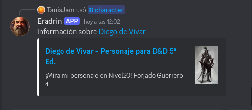
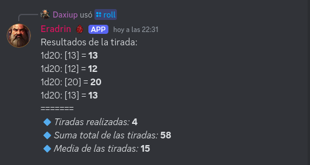
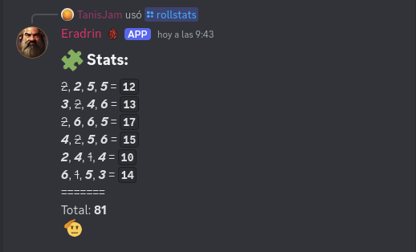

<div align="center">


# Eradrin Bot

Eradrin Bot is a Discord bot that acts as a chatbot using the Gemini AI API <br/> and also provides direct links to character sheets for a D&D campaign on the Nivel20 site.<br/>This is especially useful because the Nivel20 search engine is extremely slow and inefficient.

</div>

# ✨ Features

> - **Chatbot**: Uses the Gemini AI API to answer user questions.
>
> 


>- **Search for characters**: Provides quick and direct links to character sheets on Nivel20.
>
>

>- **Roll dice**: Provides a comprehensive and acurate dice rolls using [RPG Dice Roller](https://github.com/dice-roller/rpg-dice-roller)
>
>

>- **Randoms Stats**: Rolls random stats for a character creation.
>
>


# 📦 Requirements

- Node.js
- Discord Bot Token
- Gemini AI API Key
- **`.env`** file with the following variables:
  - **`CLIENT_ID`**
  - **`TOKEN`**
  - **`GUILD_ID`**
  - **`GEMINI_API_KEY`**

# ⚡️ Quick start

1. Clone this repository:

   `git clone https://github.com/your-username/eradrin-bot.git
cd eradrin-bot`

2. Install the dependencies:

   `npm install`

3. Create a **`.env`** file in the root of the project and add your credentials:

```bash
CLIENT_ID=12345678901234567890
TOKEN=123456789qwertyuiop
GUILD_ID=12345678901234567890
GEMINI_API_KEY=123456789qwertyuiop
```

4. Build the project:

   `npm run build`

5. Start the bot:

   `npm start`

6. Deploy commands:

   `npm run deploy:commands`

# 🛎️ Available Commands

### `/ask`
- **Description**: Ask Eradrin something.
- **Options**:
  - `question` (string, required): The question you want to ask Eradrin.

### `/character`
- **Description**: Receive information about a character.
- **Options**:
  - `name` (string, required): Name of the character.

### `/ping`
- **Description**: Replies with "Pong!".

### `/roll`
- **Description**: Roll some dice.
- **Options**:
  - `dice` (integer, required): The die to roll.
    - **Available options**:
      - `d2` (2)
      - `d4` (4)
      - `d6` (6)
      - `d8` (8)
      - `d10` (10)
      - `d12` (12)
      - `d20` (20)
      - `d100` (100)
  - `number` (integer, optional): The number of dice to roll.
  - `mod` (integer, optional): The modifier to add to the result.
  - `dc` (integer, optional): The difficulty of the roll.
  - `iterations` (integer, optional): The number of times to repeat the roll.
  - `advantage` (string, optional): Whether the roll is with advantage or disadvantage.
    - **Options**:
      - `advantage` (adv)
      - `disadvantage` (dis)

### `/rollstats`
- **Description**: Generates stats for your next character (or sends you to point buy).
   
# 🎯 Upcoming Features

I am planning to add the following features to enhance the D&D experience:

 - [x] **Dice Roller**: A feature to roll dice directly within Discord, supporting various types of dice (e.g., d20, d12, d10, d8, d6, d4).
 - [x] **Random Stats Generator**: A feature to generate random for a character creation.
 - [ ] **Random Loot Generator**: Automatically generate loot for encounters, including items, gold, and other stuff.
 - [ ] **Plot Generator**: Create random plots for encounters or adventures.
 - [ ] **Encounter Generator**: Create random encounters with different levels of difficulty and variety of monsters.
 - [ ] **NPC Generator**: Generate random NPCs with unique names, backgrounds, and characteristics.


# 👩‍💻 Author

- [TanisJam](https://mnr.ar)
